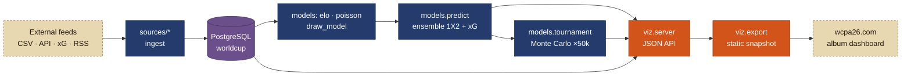

<!-- AUTO-GENERATED by `python run.py graph` — do not edit by hand. -->
# WCPA — Backend Architecture (connected graph)

_Generated 2026-06-08T15:28:08 · 24 modules · 4,916 lines · 76 import edges._

A pure-stdlib AST scan of the engine. Re-run `python run.py graph` any time the
code changes and this regenerates itself. In VS Code, open the Markdown preview
(`Ctrl+Shift+V`) with the **Markdown Preview Mermaid Support** extension to see
the graphs; for a draggable, zoomable, live version open **`/graph`** on the dev
server (`python run.py viz`) or the exported site.

## Live data snapshot

| Metric | Value |
|---|---|
| matches | 49,378 |
| finished matches | 49,306 |
| teams | 336 |
| rated teams | 336 |
| news | 370 |
| predictions | 9 |
| date range | 1872-11-30 → 2026-06-27 |
| last simulation | 50,000 runs · leader **Argentina** |

## Module dependency graph

Solid arrows are `import` dependencies (A → B means *A imports B*). Dashed arrows
are runtime I/O: the database, external feeds and the browser. `⛁` = touches
PostgreSQL, `🌐` = reaches the network.

```mermaid
flowchart LR
  classDef entry fill:#e3a512,stroke:#7a5a06,color:#20150c,stroke-width:2px;
  classDef core fill:#3a2a1a,stroke:#20150c,color:#f3e7c8,stroke-width:2px;
  classDef sources fill:#1f8a70,stroke:#0f5a47,color:#ffffff,stroke-width:2px;
  classDef models fill:#243b6b,stroke:#152b52,color:#ffffff,stroke-width:2px;
  classDef viz fill:#d2541b,stroke:#8f3710,color:#ffffff,stroke-width:2px;
  classDef external fill:#e8d8b2,stroke:#8a7647,color:#20150c,stroke-width:2px;
  classDef store fill:#6b4f8a,stroke:#43305a,color:#ffffff,stroke-width:2px;
  classDef ext fill:#e8d8b2,stroke:#8a7647,color:#20150c,stroke-width:1.5px,stroke-dasharray:4 3;
  subgraph L_entry["Entry points"]
    direction TB
    run["run<br/>261 LOC  ⛁"]
    viz_server["viz.server<br/>552 LOC  ⛁"]
  end
  subgraph L_sources["Data sources"]
    direction TB
    sources_news["sources.news<br/>154 LOC  ⛁  🌐"]
    sources_results["sources.results<br/>157 LOC  ⛁  🌐"]
    sources_sportsdb["sources.sportsdb<br/>103 LOC  ⛁  🌐"]
    sources_statsbomb["sources.statsbomb<br/>127 LOC  ⛁  🌐"]
  end
  subgraph L_core["Core"]
    direction TB
    config["config<br/>191 LOC"]
    db["db<br/>83 LOC  ⛁"]
  end
  subgraph L_models["Models"]
    direction TB
    models_backtest["models.backtest<br/>369 LOC  ⛁"]
    models_bivpoisson["models.bivpoisson<br/>257 LOC  ⛁"]
    models_draw_model["models.draw_model<br/>155 LOC  ⛁"]
    models_elo["models.elo<br/>148 LOC  ⛁"]
    models_field_2026["models.field_2026<br/>99 LOC"]
    models_metrics["models.metrics<br/>114 LOC"]
    models_poisson["models.poisson<br/>292 LOC  ⛁"]
    models_predict["models.predict<br/>135 LOC  ⛁"]
    models_qmc["models.qmc<br/>193 LOC"]
    models_tournament["models.tournament<br/>366 LOC  ⛁"]
    models_tune["models.tune<br/>263 LOC"]
    models_variance["models.variance<br/>272 LOC"]
  end
  subgraph L_viz["Visualisation"]
    direction TB
    viz_export["viz.export<br/>260 LOC  ⛁"]
    viz_flags["viz.flags<br/>77 LOC"]
    viz_loadtest["viz.loadtest<br/>152 LOC  🌐"]
    viz_ogcard["viz.ogcard<br/>136 LOC  🌐"]
  end
  PG[("PostgreSQL<br/>worldcup")]
  class PG store;
  ext_martj42["martj42 results CSV"]
  class ext_martj42 ext;
  ext_sportsdb["TheSportsDB API"]
  class ext_sportsdb ext;
  ext_statsbomb["StatsBomb open data"]
  class ext_statsbomb ext;
  ext_rss["News RSS"]
  class ext_rss ext;
  BROWSER["Browser / Dashboard"]
  class BROWSER ext;
  db --> config
  run --> config
  run --> db
  run --> models_backtest
  run --> models_bivpoisson
  run --> models_draw_model
  run --> models_elo
  run --> models_field_2026
  run --> models_poisson
  run --> models_predict
  run --> models_tournament
  run --> models_tune
  run --> models_variance
  run --> sources_news
  run --> sources_results
  run --> sources_sportsdb
  run --> sources_statsbomb
  run --> viz_export
  run --> viz_loadtest
  run --> viz_ogcard
  run --> viz_server
  models_backtest --> config
  models_backtest --> db
  models_backtest --> models_bivpoisson
  models_backtest --> models_draw_model
  models_backtest --> models_elo
  models_backtest --> models_metrics
  models_backtest --> models_poisson
  models_bivpoisson --> config
  models_bivpoisson --> db
  models_bivpoisson --> models_poisson
  models_draw_model --> config
  models_draw_model --> db
  models_draw_model --> models_elo
  models_elo --> config
  models_elo --> db
  models_poisson --> config
  models_poisson --> db
  models_predict --> config
  models_predict --> db
  models_predict --> models_bivpoisson
  models_predict --> models_draw_model
  models_predict --> models_elo
  models_predict --> models_poisson
  models_tournament --> config
  models_tournament --> db
  models_tournament --> models_field_2026
  models_tournament --> models_predict
  models_tournament --> models_qmc
  models_tune --> config
  models_tune --> models_backtest
  models_tune --> models_draw_model
  models_tune --> models_metrics
  models_variance --> config
  models_variance --> models_field_2026
  models_variance --> models_predict
  models_variance --> models_qmc
  models_variance --> models_tournament
  sources_news --> config
  sources_news --> db
  sources_results --> config
  sources_results --> db
  sources_sportsdb --> config
  sources_sportsdb --> db
  sources_statsbomb --> config
  sources_statsbomb --> db
  viz_export --> config
  viz_export --> db
  viz_export --> models_field_2026
  viz_export --> viz_server
  viz_server --> config
  viz_server --> db
  viz_server --> models_field_2026
  viz_server --> models_predict
  viz_server --> sources_news
  viz_server --> viz_flags
  db -.->|psycopg| PG
  sources_results -.->|fetch| ext_martj42
  sources_sportsdb -.->|fetch| ext_sportsdb
  sources_statsbomb -.->|fetch| ext_statsbomb
  sources_news -.->|fetch| ext_rss
  viz_server -.->|JSON API| BROWSER
  viz_export -.->|static snapshot| BROWSER
  class config core;
  class db core;
  class run entry;
  class models_backtest models;
  class models_bivpoisson models;
  class models_draw_model models;
  class models_elo models;
  class models_field_2026 models;
  class models_metrics models;
  class models_poisson models;
  class models_predict models;
  class models_qmc models;
  class models_tournament models;
  class models_tune models;
  class models_variance models;
  class sources_news sources;
  class sources_results sources;
  class sources_sportsdb sources;
  class sources_statsbomb sources;
  class viz_export viz;
  class viz_flags viz;
  class viz_loadtest viz;
  class viz_ogcard viz;
  class viz_server entry;
```

## Data-flow pipeline

How a result becomes a prediction on the wall — feeds in, album out.

## Modules

| Module | Layer | LOC | Deps | Role |
|---|---|---:|---:|---|
| `run` | entry | 261 | 20 | ⛁ World Cup 2026 prediction engine — command line. |
| `viz.server` | entry | 552 | 6 | ⛁ World Cup 2026 dashboard — pure-stdlib HTTP server. |
| `sources.news` | sources | 154 | 2 | ⛁ 🌐 Live news feed ingestion. |
| `sources.results` | sources | 157 | 2 | ⛁ 🌐 Historical results ingestion. |
| `sources.sportsdb` | sources | 103 | 2 | ⛁ 🌐 Live fixtures + results via TheSportsDB (free public key "3"). |
| `sources.statsbomb` | sources | 127 | 2 | ⛁ 🌐 xG ingestion from StatsBomb open data. |
| `config` | core | 191 | 0 | Central configuration for the World Cup 2026 prediction engine. |
| `db` | core | 83 | 1 | ⛁ Database access layer. |
| `models.backtest` | models | 369 | 7 | ⛁ Leakage-free walk-forward backtest for the match models. |
| `models.bivpoisson` | models | 257 | 3 | ⛁ Bivariate-Poisson goals model (pure Python, no numpy/scipy). |
| `models.draw_model` | models | 155 | 3 | ⛁ Empirical Elo -> 1X2 mapping via an ordered-logistic model. |
| `models.elo` | models | 148 | 2 | ⛁ International Elo rating engine. |
| `models.field_2026` | models | 99 | 0 | Official 48-team draw for the 2026 FIFA World Cup (USA / Canada / Mexico). |
| `models.metrics` | models | 114 | 0 | Probabilistic scoring metrics for 1X2 (home / draw / away) forecasts. |
| `models.poisson` | models | 292 | 2 | ⛁ Dixon-Coles style goals model (pure Python, no numpy/scipy). |
| `models.predict` | models | 135 | 6 | ⛁ Ensemble match predictor. |
| `models.qmc` | models | 193 | 0 | Quasi-Monte Carlo + variance-reduction primitives for the tournament simulator. |
| `models.tournament` | models | 366 | 5 | ⛁ World Cup 2026 Monte Carlo tournament simulator. |
| `models.tune` | models | 263 | 4 | Hyperparameter tuning by held-out RPS — coordinate descent over the backtest. |
| `models.variance` | models | 272 | 5 | Variance-reduction benchmark for the World Cup Monte-Carlo simulator. |
| `viz.export` | viz | 260 | 4 | ⛁ Static-snapshot exporter for the WCPA (World Cup Prediction Album) dashboard. |
| `viz.flags` | viz | 77 | 0 | Team -> flag + confederation lookups for the dashboard. |
| `viz.loadtest` | viz | 152 | 0 | 🌐 Stdlib load tester for the static WCPA build — proof it survives a World-Cup traffic spike. |
| `viz.ogcard` | viz | 136 | 0 | 🌐 Original OG / share-card generator for WCPA (build-time, Pillow). |

## Live HTTP API (9 endpoints)

`/api/bracket`, `/api/fixtures`, `/api/groupadv`, `/api/history`, `/api/meta`, `/api/news`, `/api/predict`, `/api/rankings`, `/api/report`

## CLI commands (21)

`audit`, `backtest`, `calibrate`, `export`, `graph`, `groups`, `health`, `ingest`, `init`, `loadtest`, `loop`, `news`, `ogcard`, `predict`, `rankings`, `refresh`, `simulate`, `simvar`, `train`, `tune`, `viz`
